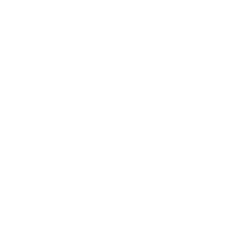

<link rel="stylesheet" href="https://cdn.jsdelivr.net/gh/devicons/devicon@v2.14.0/devicon.min.css">

## Hi 👋, I'm Lautaro Valentini

A Javascript Fullstack Developer passionate about systems, new technologies and everything related to the web world ❤

- 🌱  I’m currently working at **[@digiventures](https://www.digiventures.la/)**

- 👨‍💻  Actually working with **[React JS](https://es.reactjs.org/)**, **[Next JS](https://nextjs.org/)**, **[Node JS](https://nodejs.org/es/)**, **[Express JS](https://expressjs.com/es/)**, and **[MongoDB](https://www.mongodb.com) database**

- 🤝  Enthusiastic about participating in new projects

- 📫  How to reach me **[LinkedIn](https://www.linkedin.com/in/lautivalentini/)**

<h3 align="left">Languages and Tools:</h3>

    

        
        
        
        
        
        
        
    

